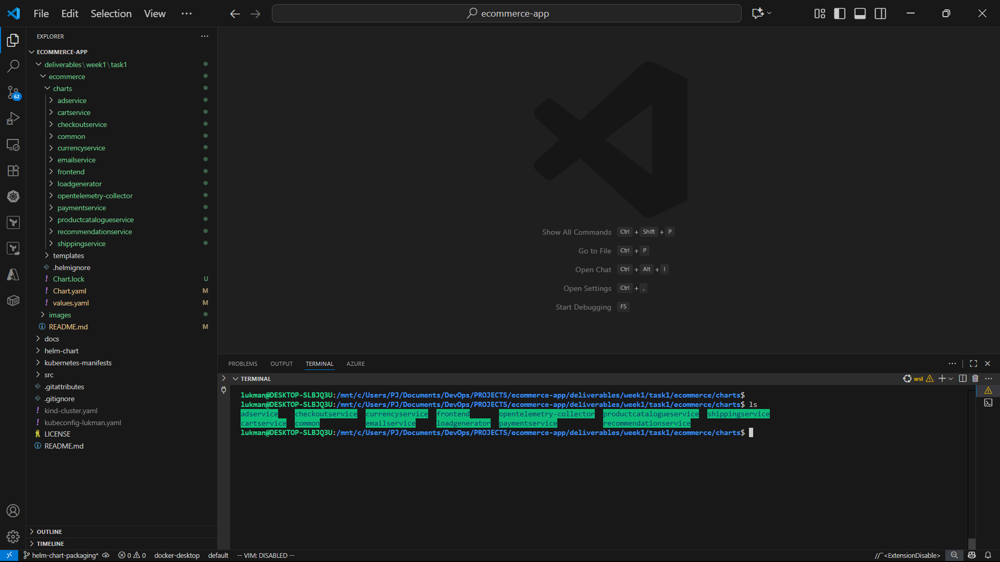

# Ecommerce Kubernetes Project

## 📌 Overview
This project demonstrates deploying and managing an **Ecommerce application** composed of multiple microservices using **Helm** and a local Kubernetes cluster with **Kind**.

The application is based on Google’s **Online Boutique (microservices-demo)** and has been packaged as a **Helm umbrella chart** with subcharts for each microservice.

---

## 🧩 Components
- **Kind**: Used for setting up and managing a local Kubernetes cluster.
- **Helm**: Kubernetes package manager, used here to create and manage the umbrella chart and its subcharts.

---

## 📂 Deployment
The ecommerce application was deployed using helm chart. The helm chart is actually an umbrella chart made up of several subcharts
## 📂 Setup

### 1. Umbrella Helm Chart
An umbrella Helm chart called ecommerce was created for the Ecommerce application in a namespace called ecommerce-app
It includes subcharts for the following services:

- frontend
- cartservice
- productcatalogservice
- adservice
- checkoutservice
- currencyservice
- emailservice
- paymentservice
- recommendationservice
- shippingservice


---

## 🔍 Creating the Umbrella Helm Chart
The umbrella chart called ecommerce was created using the command below  

```bash
helm create ecommerce . -n ecommerce-app
```


##### Fig 1.0 Creating umbrella chart called Ecommerce

## 🔍 Sub-charts Creation
After creating the umbrella chart, the sub-charts were created. Each subchart represents a service. To create the sub-charts, cd in to charts folder of the umbrella chart(i.e. ecommerce) and run the command below for each service


```bash
helm create frontend . -n ecommerce-app # sub-chart for frontend service
```
```bash
helm create cartservice -n ecommerce-app # sub-chart for cartservice
```
```bash
helm create productcatalogueservice -n ecommerce-app # sub-chart for  productcatalogueservice
```
```bash
helm create checkoutservice -n ecommerce-app # sub-chart for  checkoutservice
```
```bash
helm create paymentservice -n ecommerce-app # sub-chart for paymentservice
```
```bash
helm create recommendationservice -n ecommerce-app  # sub-chart for recommendationservice
```
```bash
helm create currencyservice -n ecommerce-app  # sub-chart for currencyservice
```
```bash
helm create adservice -n ecommerce-app   # sub-chart for adservice
```
```bash
helm create loadgenerator -n ecommerce-app   # sub-chart for loadgenerator
```
```bash
helm create opentelemetry-collector -n ecommerce-app   # sub-chart for pentelemetry-collector 
```
```bash
helm create shippingservice -n ecommerce-app  # sub-chart for shippingservice
```
```bash
helm create emailservice -n ecommerce-app  # sub-chart for emailservice
```

```bash
helm create common -n ecommerce-app  # sub-chart for common
```


#### Fig 1.1. Frontend sub-chart 

 The sub-charts eventually created were frontend, cartservice, frontend, cartservice, productcatalogueservice, shippingservice,emailservice, common, checkoutservice, paymentservice, recommendationservice, currencyservice, adservice, loadgenerator, opentelemetry-collector

 

#### Fig 1.2. All sub-chart 


Next, we connect the subcharts to the umbrella chart by adding  a dependency section to the ecommerce Chart.yaml file


#### Fig 1.3. Chart Dependencies

## 🔍 Helm Chart Validation

 Run the dependency update command inside the ecommerce parent chart folder. This ensures Helm knows about the subcharts and then packages them correctly.  After then, we run helm lint command to validate the helm chart.
The dependency update command  and helm lint commands are stated below

```bash
helm dependency update 
```

```bash
helm lint .
```

#### Fig 1.4. Helm dependency update and linting


Each subchart inherits global values (like image repository, replica count, and tags) from the parent chart. The configuration can be found in the values.yaml file of the ecommerce chart(i.e. the umbrella chart)


#### Fig 1.5.  Subcharts inheriting global values


## 🔍 Deployment of the application using Helm Chart
Run the command below to deploy the ecommerce application using helm chart in the ecommerce-app namespace.

```bash
helm install ecommapp -n ecommerce-app 
```


